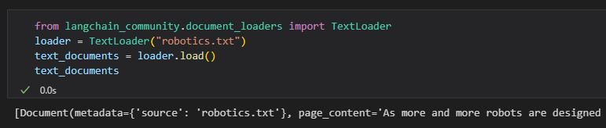
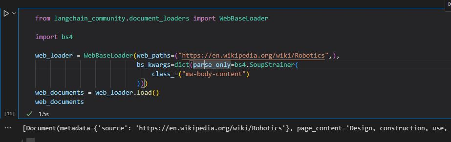
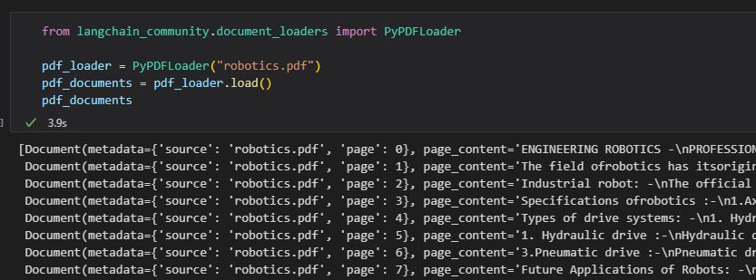
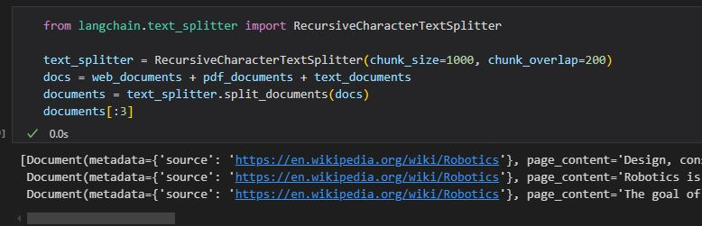
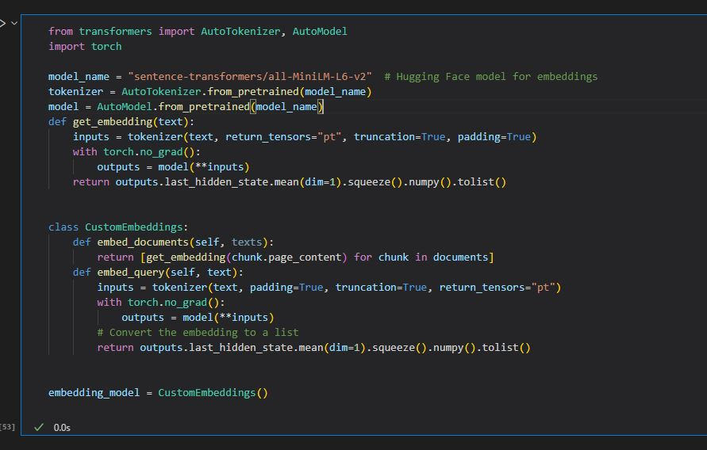
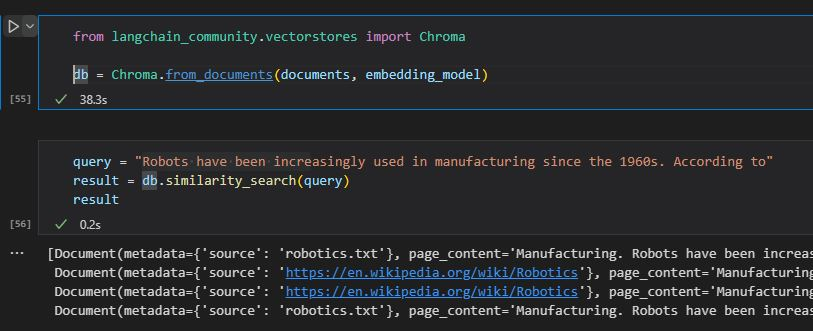
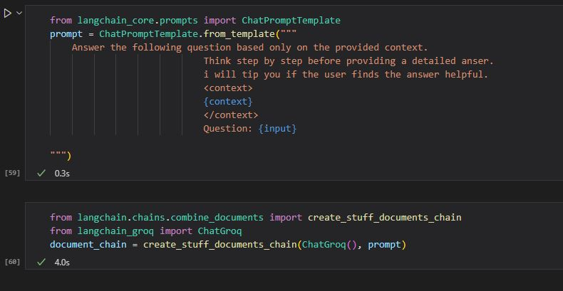
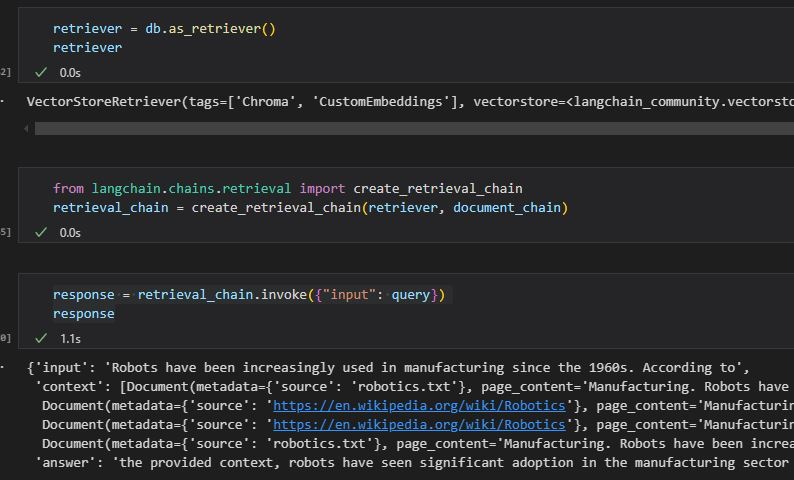
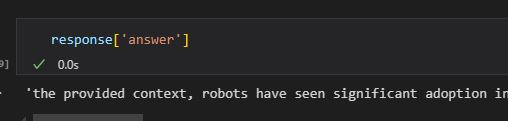

# Langchain Simple RAG Project

This project demonstrates a basic Retrieval-Augmented Generation (RAG) system that loads documents from text files, websites, and PDF files. The implementation can be found in [rag/simplerag.ipynb](./rag/simplerag.ipynb) and follows the steps outlined below:

## Document Loading
- **Text Files**: Loaded using `TextLoader` from `langchain_community.document_loaders`, with an example file located at [rag/robotics.txt](./rag/robotics.txt).  
  
  
- **Web Content**: Loaded from [Wikipedia](https://en.wikipedia.org/wiki/Robotics) using `WebBaseLoader`.  
  
  
- **PDF Files**: Loaded using `PyPDFLoader` from the same library, with the PDF located at [rag/robotics.pdf](./rag/robotics.pdf).  
  

## Text Splitting
- Used `RecursiveCharacterTextSplitter` from `langchain.text_splitter` to split documents into 1,000-character chunks with 200-character overlap.  
  

## Embedding with HuggingFace
- Tokenized and embedded document chunks using the `sentence-transformers/all-MiniLM-L6-v2` model from HuggingFace.  
  

## Vector Store with ChromaDB
- Implemented a vector store using `ChromaDB` to manage embeddings.  
  

## Document Chain with Prompt Template
- Created a document chain using a custom prompt that takes user queries as `input` and relevant document chunks as `context`, powered by `create_stuff_documents_chain` from `langchain.chains.combine_documents` and the `ChatGroq` model.  
  

## Retrieval Chain with ChromaDB
- Built a retriever using `db.as_retriever()` and constructed a retrieval chain via `create_retrieval_chain` from `langchain.chains.retrieval`.  
  
  

# Setup
- Create virtual environment:  `python -m venv venv`
- Activate virtual environment: `call venv/Scripts/activate.bat` in cmd
- Install dependencies: `pip install -r requirements.txt`
- Create environment variables `LANGCHAIN_API_KEY` and `GROQ_API_KEY`. You can get your langchain api key from [here](https://smith.langchain.com/), and your groq api key from [here](https://console.groq.com/keys).

# Libraries
- Langchain
- Langchain Groq
- Python-Dotenv
- Langchain
- PyPDF
- bs4
- chromadb
- transformers
- torch

## Contact
 - LinkedIn: [Natan Asrat](https://linkedin.com/in/natan-asrat)
 - Gmail: nathanyilmaasrat@gmail.com
 - Telegram: [Natan Asrat](https://t.me/fail_your_way_to_success)
 - Youtube: [Natville](https://www.youtube.com/@natvilletutor)

